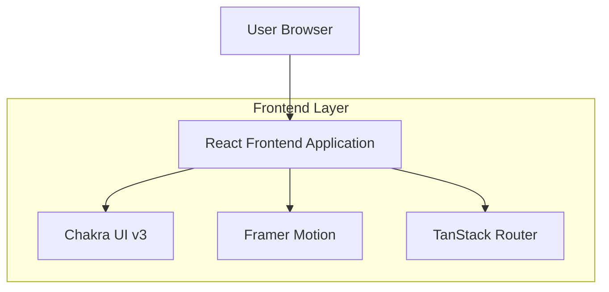

## 1.Architecture design

## 2.Technology Description
- Frontend: React@19 + vite + @chakra-ui/react@3 + framer-motion@12 + @tanstack/react-router@1
- Backend: None

## 3.Route definitions
| Route | Purpose |
|---|---|
| / | Home com seções (âncoras) |
| /design-system | Página interna para validar UI e padrões (inclui motion showcase) |

## 4.API definitions (If it includes backend services)
N/A

## 6.Data model(if applicable)
N/A

---

### Padrões reutilizáveis recomendados (Motion + Chakra)
1) **Camada de tokens de motion (centralizada)**
- `durations`: fast(120–160ms), base(200–260ms), slow(360–420ms)
- `easings`: easeOut, easeInOut (curvas suaves), spring padrão (stiffness/damping)
- `distances`: y=12–24px para reveal; scale=0.98–1.02 para microinterações

2) **Componentes Motion com Chakra (base)**
- `MotionBox`, `MotionStack`, `MotionFlex`, `MotionImage` usando `chakra(motion.div|img)`.
- `MotionButton` (wrapper para aplicar `whileHover/whileTap` sem duplicar props).

3) **Variantes (variants) padrão**
- `reveal.fadeUp`: hidden({opacity:0,y:16}) → show({opacity:1,y:0})
- `reveal.fade`: hidden({opacity:0}) → show({opacity:1})
- `list.stagger`: container com `staggerChildren` + itens `fadeUp`
- `drawer.slideLeft`: hidden({x:-24,opacity:0}) → show({x:0,opacity:1})

4) **Hooks utilitários**
- `usePrefersReducedMotion`: desabilitar/encurtar animações (respeitar sistema).
- `useInView`/`whileInView`: revelar seções apenas uma vez (viewport: { once: true, amount: 0.2–0.3 }).

5) **Regras de uso (governança)**
- Evitar animar layout pesado continuamente (ex.: sombras grandes, filtros intensos em scroll).
- Animar propriedades baratas (opacity, transform).
- Uma linguagem consistente: mesma duração/easing por categoria (reveal vs microinteração).
- Priorizar acessibilidade: foco visível permanece Chakra; motion não pode “esconder” foco.
